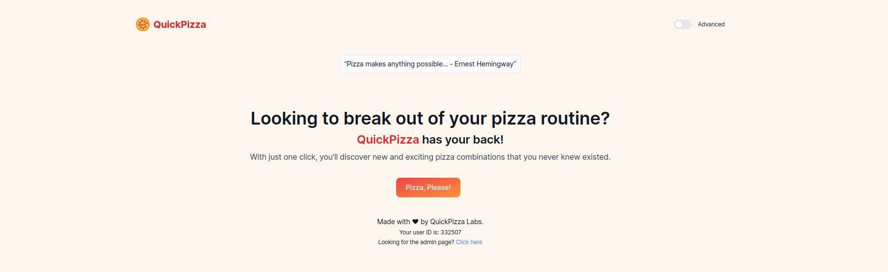
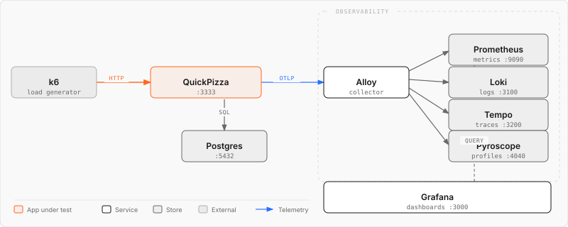

# Lab setup

In this workshop, you'll learn how to create load tests to verify the performance of QuickPizza, a simple demo application, under load.



QuickPizza is available in three environments:
- [localhost:3333](http://localhost:3333/): a local environment that runs with Docker.
- [quickpizza.grafana.com](https://quickpizza.grafana.com/): a shared test environment for small-scale load tests.
- [quickpizza.grafana.fun](https://quickpizza.grafana.fun/): a shared test environment for small-scale load tests that also lets you visualize results in [Grafana Play](https://play.grafana.org/).

## Installation steps

_**Need help?** Raise your hand and we'll come help._

Clone the repo and start QuickPizza on your local machine:

```bash
git clone git@github.com:grafana/opensouthcode-2026-k6-workshop.git
cd opensouthcode-2026-k6-workshop
docker compose up -d
```

The output should be similar to:

```bash
[+] up 10/10
✔ Network opensouthcode-2026-k6-workshop_default Created 0.0s 
✔ Volume opensouthcode-2026-k6-workshop_postgres_data Created 0.0s 
✔ Container pyroscope Started 0.3s 
✔ Container grafana Started 0.3s 
✔ Container loki Started 0.3s 
✔ Container prometheus Started 0.3s 
✔ Container quickpizza-db Healthy 10.8s 
✔ Container tempo Started 0.3s 
✔ Container quickpizza Started 10.8s 
✔ Container alloy Started 10.8s
```

> To reset the environment, run `docker compose down -v` to stop the containers and remove attached volumes.

Quickpizza should now be running at [localhost:3333](http://localhost:3333/).

Install [k6 OSS](https://grafana.com/docs/k6/latest/set-up/install-k6/) on your machine. 

We recommend installing it using your operating system's package manager. After installation, you might need to open a new terminal session so it picks up the updated `PATH` and recognizes the `k6` CLI.

Next, run a basic k6 test to verify your installation and test environment:

```bash
k6 run k6-test.js
```

<details>
<summary>Alternative: run k6 from Docker</summary>

`docker compose up -d` also starts a `k6` container alongside the rest of the stack, so you don't need to install the k6 CLI locally. Run tests inside it with:

```bash
docker compose exec k6 k6 run k6-test.js
```

</details>

<details>
<summary>Alternative: run the test against a remote testing environment</summary>

```bash
k6 run -e BASE_URL=https://quickpizza.grafana.com k6-test.js
```

</details>

The output should look similar to:

```bash
...
running (00m00.1s), 0/1 VUs, 1 complete and 0 interrupted iterations
default ✓ [======================================] 1 VUs  00m00.1s/10m0s  1/1 iters, 1 per VU
```

You'll continue building on this k6 script in the next exercises.

## Related Resources

The following diagram shows the Docker Compose architecture used in this workshop:



- [k6 OSS documentation](https://grafana.com/docs/k6/latest/)
- [github.com/grafana/quickpizza](https://github.com/grafana/quickpizza): This repository can be used to learn and explore the Grafana observability stack.

---

[Workshop homepage](https://github.com/grafana/opensouthcode-2026-k6-workshop) · [Next exercise →](../2.basic-load-test/)