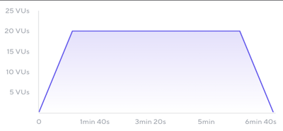
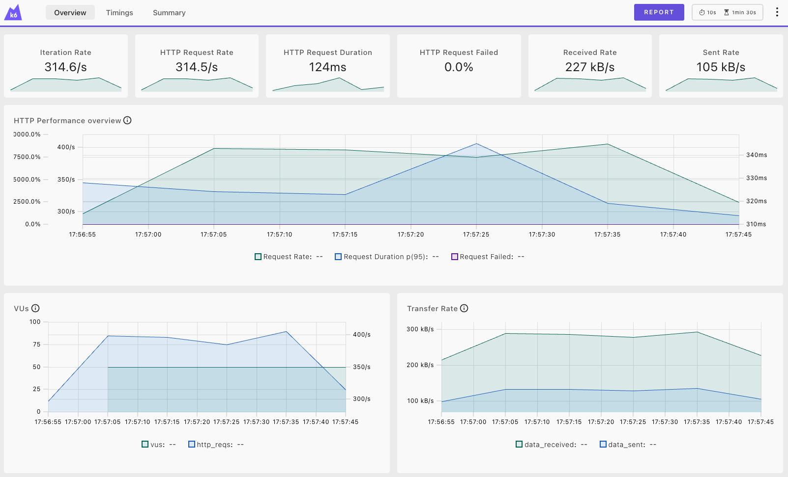

# Run a basic load test

_**Need help?** Raise your hand and we'll come help._

In this exercise, you'll run your first load test.

During normal operation, QuickPizza typically receives around **50 concurrent users**. Let's use that as the starting point for our first test.

How long should the test run? For meaningful results, load tests are often run for **at least 5 minutes** to observe how the system behaves under sustained load.

For this workshop, we'll keep things short and set the duration to **1 minute**.

```js
export const options = {
  vus: 50,
  duration: '1m',
};
```

This configuration generates a flat traffic pattern: the test starts with 50 virtual users and ends with 50 virtual users.

In practice, traffic usually ramps up and down over time. You can model this behavior using ramping stages.



A common recommendation is to spend between between 5% to 10% of the total duration to ramp up and ramp down the load.

Now, update the previous `k6-test.js` test:

1. Use the [`stages` k6 option](/docs/k6/latest/using-k6/k6-options/reference/#stages) to configure a ramping load pattern.

2. In the test scenario, add a 1-second pause after ordering a pizza using [`sleep(1)`](https://grafana.com/docs/k6/latest/javascript-api/k6/sleep/). 

When your `k6-test.js` is ready, run it with the `--out` option.

```bash
k6 run --out web-dashboard k6-test.js
```

The `--out web-dashboard` option displays metrics in a simple web dashboard so you can watch test results in real time. Visit [http://127.0.0.1:5665/ui/](http://127.0.0.1:5665/ui/).



Finally, explore these common performance metrics:

- **Virtual users** (traffic)
- **Request duration** (latency)
- **Request failed** (errors)

## Related Resources

- [k6 Documentation: Get started](https://grafana.com/docs/k6/latest/get-started/)
- [k6 Documentation: Load test types](https://grafana.com/docs/k6/latest/testing-guides/test-types/)
- [k6 Documentation: Web dashboard](https://grafana.com/docs/k6/latest/results-output/web-dashboard/)

---

[← Previous exercise](../1.lab-setup/) · [Workshop homepage](https://github.com/grafana/opensouthcode-2026-k6-workshop) · [Next exercise →](../3.workload-in-rps/)
