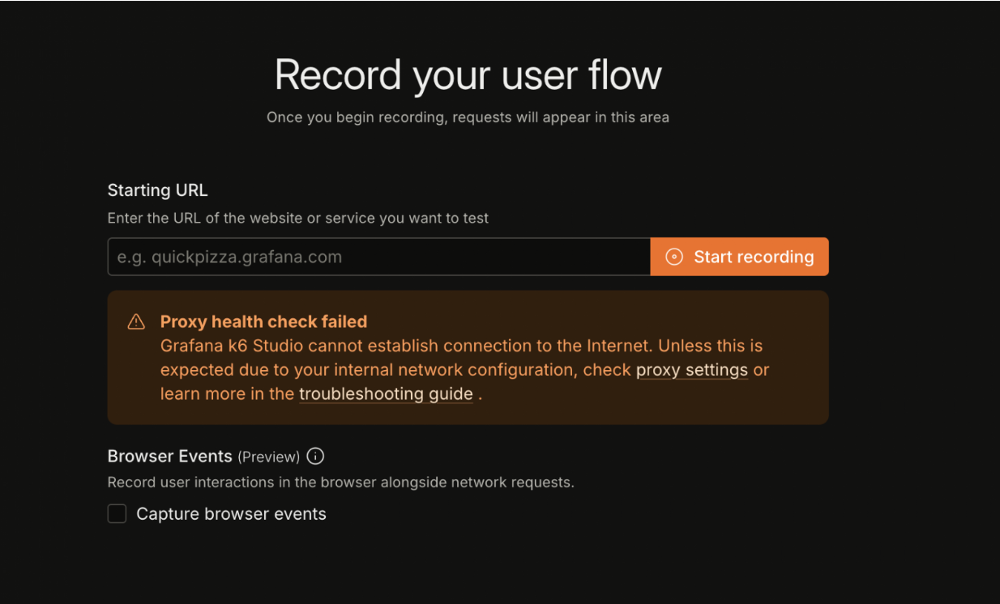
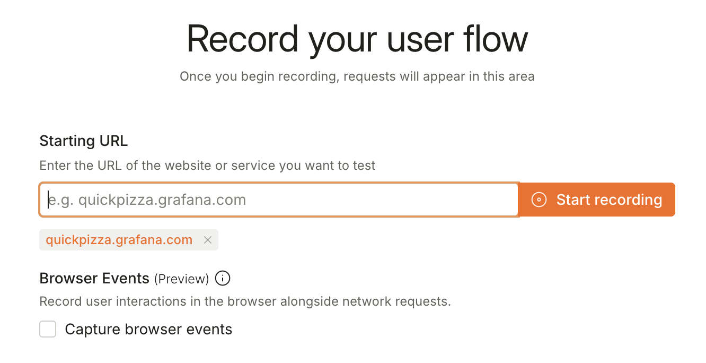
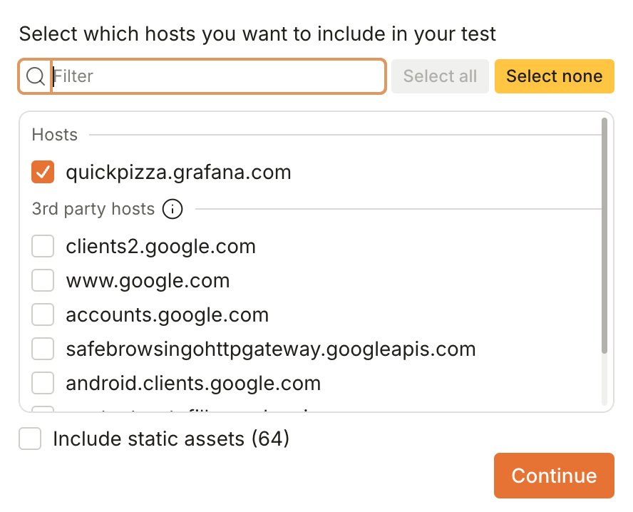
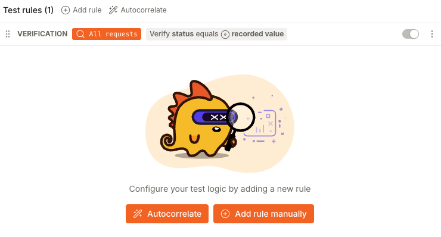
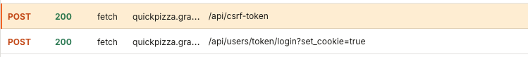

# Introduction to k6 Studio

_**Need help?** Raise your hand and we'll come help._

In this exercise, you'll use k6 Studio to record the QuickPizza login flow and turn it into a runnable k6 script.

**Troubleshooting**

The first time you launch k6 Studio after installation, you may see a proxy-related error like this:



Fully quit the application and open it again. That usually clears it.

**Step 1: Record the QuickPizza login flow**

1. Open the k6 Studio application.
2. On the landing page, click **Record flow**.
3. Enter the URL: `https://quickpizza.grafana.com`
4. **Untick** the **Capture browser events** checkbox as we won't need this for this exercise.

   

5. Click **Start recording**.
6. In the QuickPizza browser window that opens, perform the login flow:
	- Username: `default`
	- Password: `12345678`
8. Request a pizza recommendation.
9. Back in k6 Studio, click **Stop recording** when you're done.

**Step 2: Create a test from the recording**

1. Click **Create test > HTTP test** to generate a k6 script from the captured HTTP requests.
2. Select **only** `quickpizza.grafana.com` as the allowed host. This keeps the test focused on our system and excludes third-party resources.

   

3. Click **Continue**.

**Step3: Review recorded requests and generated script** 

1. On the **Requests** tab, review the recorded requests.
2. Click **Script** to review the generated k6 script.

You can now export or copy the script and run it like any other k6 test.

**Step4: Correlate data between requests** 

In this exercise, you'll implement request correlation for the `CSRF_TOKEN` used during login.

> When using recorders, data correlation refers to the process of capturing dynamic values from one response and passing it to subsequent requests.

In k6 Studio, you can implement correlations by using:

- **Grafana Assistant Autocorrelate** (requires a free Grafana Cloud account) 
- **Test rules** configured manually in the UI. These rules are available only in k6 Studio and exist separately from the generated k6 script.

	


Correlate the `CSRF` token using the **Test rules** option:

1. Find the requests involved in the correlation and inspect the generated script.

	

	```js
	url = http.url`https://quickpizza.grafana.com/api/csrf-token`;
	resp = http.request("POST", url, null, params);

	check(resp, { "status equals 200": (r) => r.status === 200 });

	params = {
	headers: {
		traceparent: `00-f988f51d632bb93577e6a8b5f4e6992e-6e53baa5b5e6b9d6-00`,
		"content-type": `application/json`,
		accept: `*/*`,
		origin: `https://quickpizza.grafana.com`,
		referer: `https://quickpizza.grafana.com/login`,
	},
	cookies: {},
	};

	url = http.url`https://quickpizza.grafana.com/api/users/token/login?set_cookie=true`;
	resp = http.request(
	"POST",
	url,
	`{"username":"default","password":"12345678","csrf":"0H0wQIK0DlEDcrjVsHHLY1QJE8hVx9sG"}`,
	params,
	);
	```

2. Click **Add rule > Correlation** and configure:
	- **Target**: `Headers`
	- **Type**: `Begin-End`
	- **Begin**:  `csrf_token=`
	- **End**:  `;`

3. Verify how the generated script changes.


## Related Resources

- [k6 Documentation: k6 Studio](https://grafana.com/docs/k6/latest/k6-studio/)

- [k6 Documentation: Correlation in k6 Studio](https://grafana.com/docs/k6/latest/k6-studio/components/generator/)

- [k6 Examples: Correlation and Dynamic Data](https://grafana.com/docs/k6/latest/examples/correlation-and-dynamic-data/)

---

[← Previous exercise](../4.assertions//) · [Workshop homepage](https://github.com/grafana/opensouthcode-2026-k6-workshop) · [Next exercise →](../6.infrastructure-testing/)