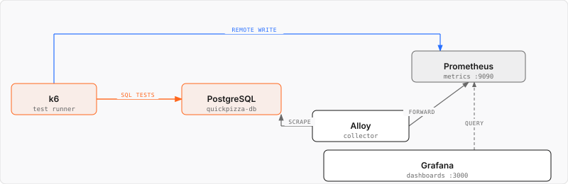
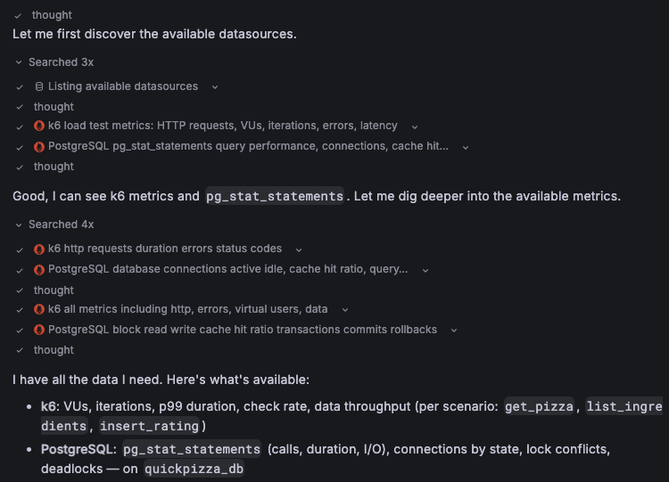
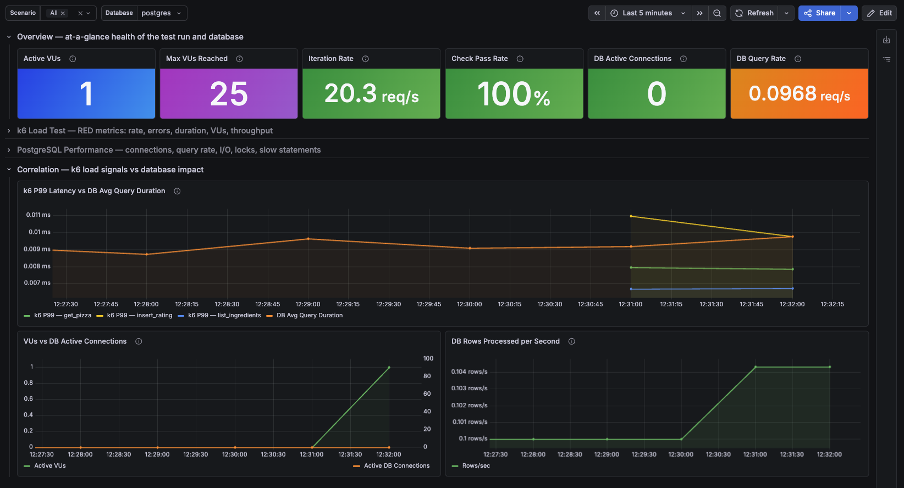

# Load testing the database

In this exercise, you'll learn how to:
- Write a load test against a database
- Send k6 results to Prometheus and visualize performance in Grafana


Open [`sql-db-k6-test.js`](./sql-db-k6-test.js) and review how it uses the `k6/x/sql` extension to interact with PostgreSQL.

This test runs three scenarios with different workload patterns:
- **Read-heavy**: list ingredients
- **Read**: random pizza lookup
- **Write**: insert a rating for a random seeded pizza

The `setup()` function prepares the test data and runs before the scenarios start. 

The `teardown()` function runs after the test completes and returns the database to its initial state.

Run the test with the `--out experimental-prometheus-rw` option to send k6 results to Prometheus.

```bash
k6 run --out experimental-prometheus-rw 6.infrastructure-testing/sql-db-k6-test.js
```

The following architecture diagram shows the data flows used in this exercise within the Docker Compose setup.



This demo includes a standard **k6 Prometheus Dashboard**, which displays primarily  HTTP request data. 

Because this test generates database traffic instead of HTTP traffic, we asked Grafana Assistant to create a custom dashboard:

> Create a dashboard that correlates k6 load test results with PostgreSQL performance metrics collected through pg_stat_statements.
>
> Use the k6 Prometheus Dashboard as a reference (without native histograms).
>
> Include the k6 RED metrics like latency, error rate, request rate, VUs, and PostgreSQL performance  metrics
>
> The goal is to detect how the workload can affect DB bottlenecks and slow responses.



The dashboard was generated by Grafana Assistant and then provisioned for this demo.

Open the [k6 + PostgreSQL Performance Comparison](http://localhost:3000/d/k6-postgresql-performance/k6-2b-postgresql-performance-correlation) dashboard and explore how the k6 workload correlates with PostgreSQL performance metrics:

- Which scenario generates the most database activity?
- Do any failures or database locks occur?
- How do query latency and throughput change during the test?




Finally, edit any panel to explore the underlying k6 and `pg_stat_statements` metrics and queries.


## Related Resources

- [github.com/grafana/xk6-sql](https://github.com/grafana/xk6-sql)
- [k6 Documentation: Test lifecycle](https://grafana.com/docs/k6/latest/using-k6/test-lifecycle/)
- [k6 Documentation: Built-in metrics](https://grafana.com/docs/k6/latest/using-k6/metrics/reference/)
- [k6 Documentation: Send k6 results to Prometheus](https://grafana.com/docs/k6/latest/results-output/real-time/prometheus-remote-write/)
- [Grafana Assistant Documentation: Enable Assistant in Grafana OSS](https://grafana.com/docs/grafana-cloud/machine-learning/assistant/get-started/self-managed/) (requires a Free Grafana Cloud account).


---

[← Previous exercise](../5.test-recorders/) · [Workshop homepage](https://github.com/grafana/opensouthcode-2026-k6-workshop)